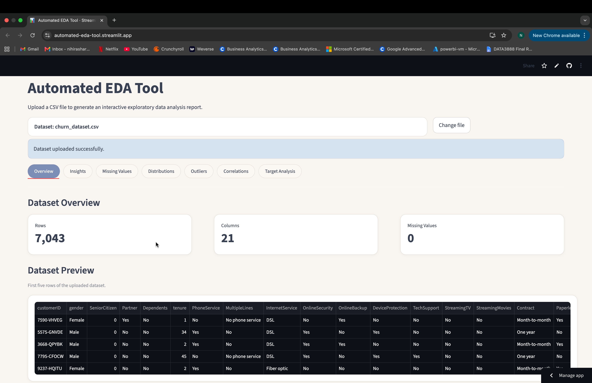
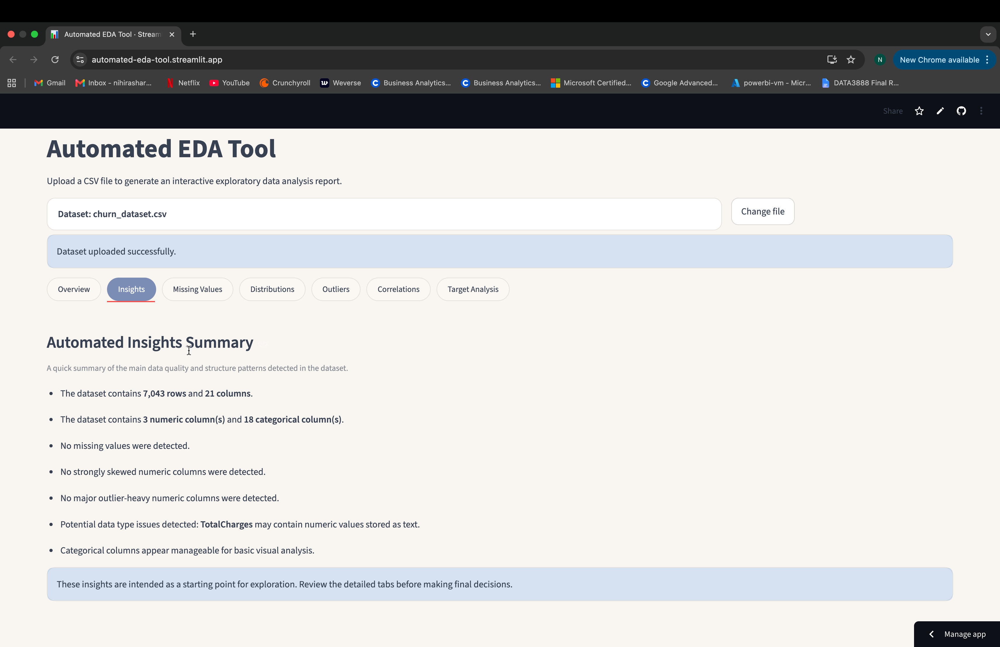
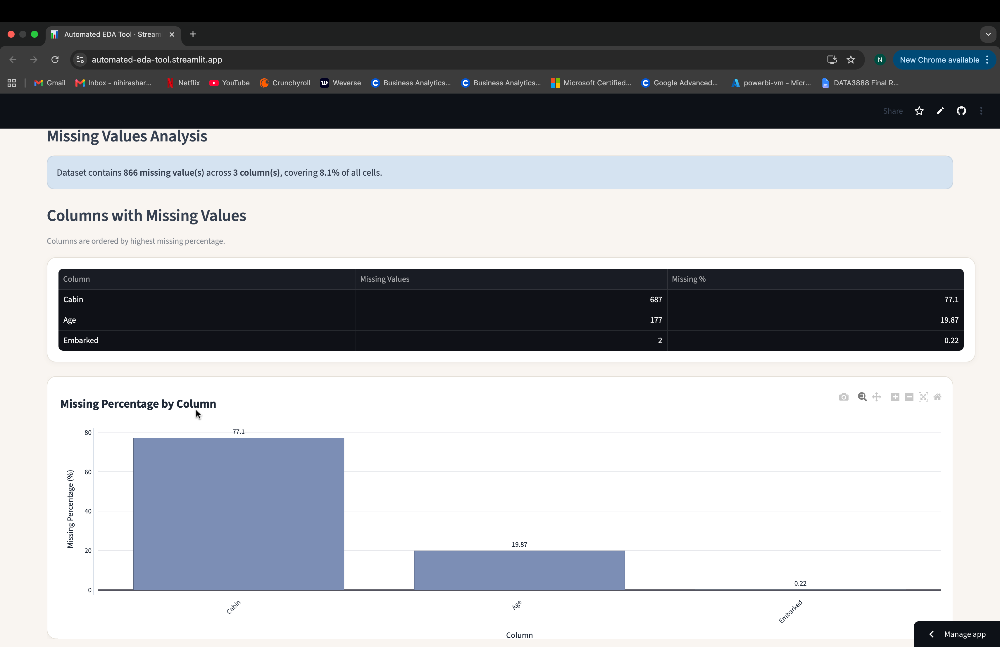
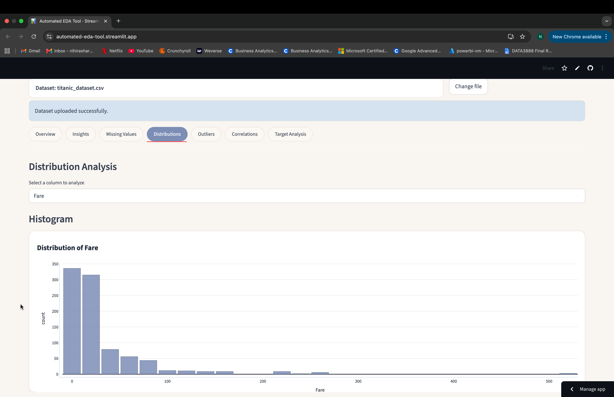
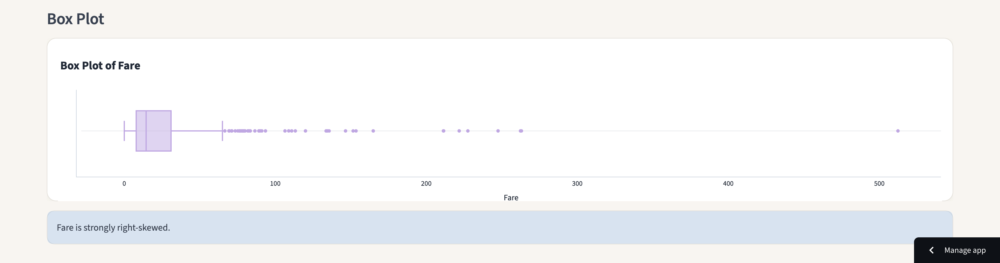
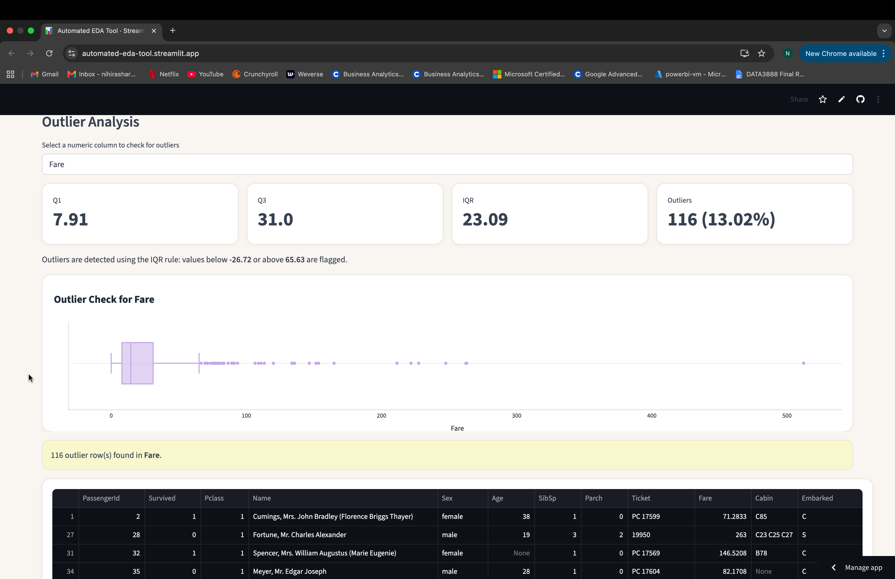
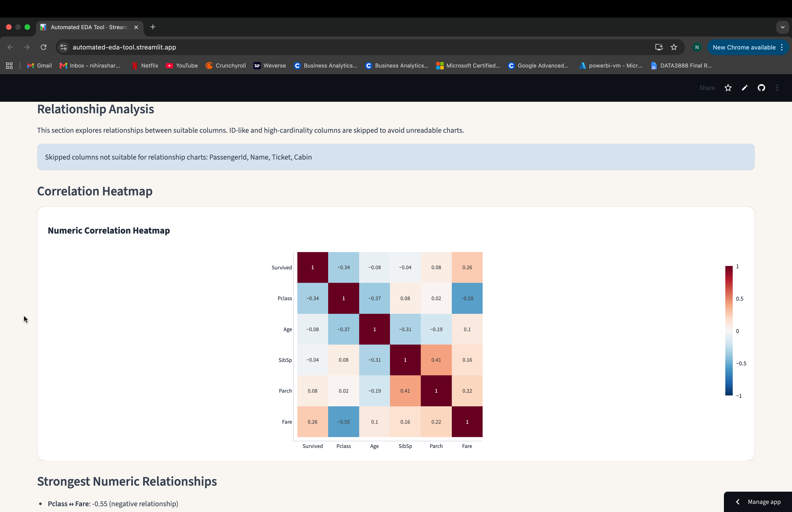
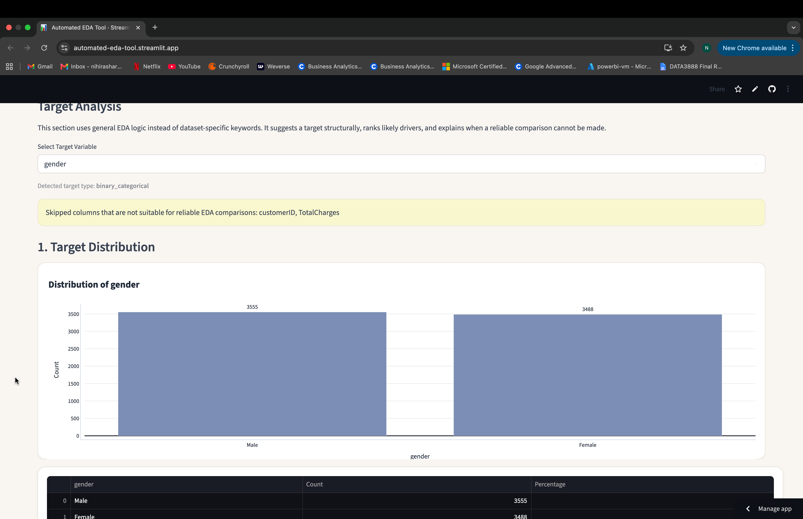
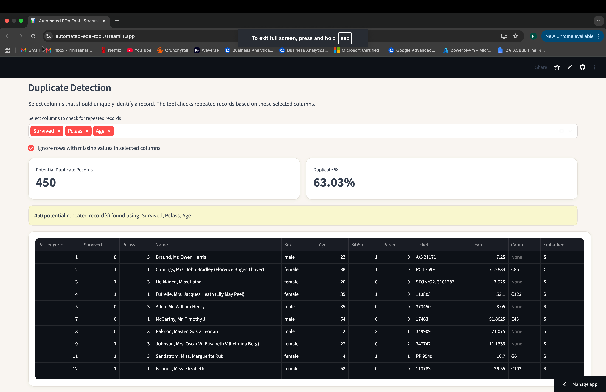

# Automated EDA Tool (Interactive Data Analysis App)

An interactive Streamlit application that performs automated Exploratory Data Analysis (EDA) on any CSV dataset.  

Users can upload a CSV file and instantly generate visualisations, statistical summaries, data quality checks, and automated insights without writing any code.

---

## Live Demo
Live app: https://automated-eda-tool.streamlit.app/ 

---

## Features

### Dataset Overview
- Dataset dimensions
- Column information
- Data type summary
- Dataset preview



### Automated Insights
- Dataset structure summary
- Missing value detection
- Skewness detection
- Outlier observations
- Data quality warnings



### Missing Value Analysis
- Missing value counts
- Missing value percentages
- Missing value visualisations



### Distribution Analysis
- Histograms
- Box plots
- Distribution interpretation
- Skewness detection




### Outlier Detection
- IQR-based outlier analysis
- Outlier counts
- Outlier percentages
- Outlier visualisation



### Correlation Analysis
- Correlation heatmaps
- Strongest numeric relationships
- Relationship analysis



### Target Variable Analysis
- Automatic target variable inspection
- Target distribution analysis
- Driver ranking
- Feature importance insights
- Relationship exploration



### Data Quality Checks
- Duplicate record detection
- Potential data type issues
- High-cardinality feature handling
- ID column detection



---

## Project Motivation

Exploratory Data Analysis is one of the most important stages of any data science workflow. However, the process is often repetitive and time-consuming.

This project was developed to automate common EDA tasks and provide analysts, students and researchers with a quick way to understand a new dataset before modelling.

The application follows a typical analyst workflow by automatically:

- Inspecting data quality
- Detecting missing values
- Identifying outliers
- Exploring distributions
- Analysing correlations
- Generating dataset insights

---

## Technologies Used

- Python
- Pandas
- Plotly
- Streamlit
- Custom CSS

---

## Project Structure

```
automated-eda-tool/
│
├── app.py                              # Main Streamlit app
├── README.md                           # Project documentation
├── requirements.txt                    # Project dependencies
│
├── modules/                            # Core EDA modules
│   ├── overview.py                     # Dataset overview and summary statistics
│   ├── insights.py                     # Automated insight generation
│   ├── missing.py                      # Missing values analysis
│   ├── distributions.py                # Distribution analysis and visualisations
│   ├── correlations.py                 # Correlation analysis and heatmaps
│   ├── outliers.py                     # Outlier detection and analysis
│   ├── target_analysis.py              # Target variable analysis and driver detection
│   └── styles.py                       # Custom UI styling
│
├── data/                               # Sample datasets for testing
│
└── screenshots/                        # Screenshots used in README
│   ├── overview.png
│   ├── overview_2.png
│   ├── insights.png
│   ├── missing_values.png
│   ├── distributions.png
│   ├── distributions_2.png
│   ├── duplicate_detection.png
│   ├── outliers.png
│   ├── correlations.png
│   └── target.png
```

---

## Installation

Clone the repository:

```bash
git clone https://github.com/Nihira11/automated-eda-tool.git
```

Move into the project directory:

```bash
cd automated-eda-tool
```

Install dependencies:

```bash
pip install -r requirements.txt
```

Run the application:

```bash
streamlit run app.py
```

---

## Example Datasets Tested

- Telco Customer Churn Dataset
- Titanic Survival Dataset
- Samll Dataset (Self-made)

The application is designed to work with most structured CSV datasets.

---

## Future Improvements

- Automated report export (PDF/HTML)
- Feature recommendation engine
- Time-series analysis support
- Advanced statistical testing
- Machine learning readiness checks
- Downloadable EDA summaries

---

## Author

Developed as a Data Analytics and Data Science portfolio project showcasing:

- Data cleaning
- Exploratory Data Analysis
- Data visualisation
- Streamlit development
- Python application development
